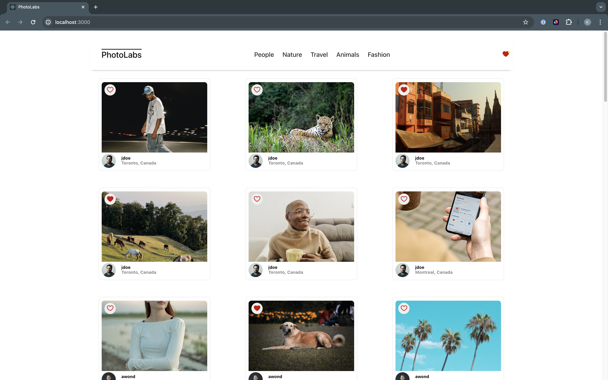

# react-photolabs
A Lighthouse Labs project: a web app built using React to view and interact with photos provided by an API.

# Photolabs



Filter by topic!


Click a photo to view details!


## Setup

1. Install dependencies with `npm install` in each respective `/frontend` and `/backend`.
2. Read and follow directions in [/backend README](./backend/README).
3. [Backend] Run the backend server.

```sh
cd backend
npm start
```
4. [Frontend] Run the Webpack development server.

```sh
cd frontend
npm start
```

5. Enjoy the app!
